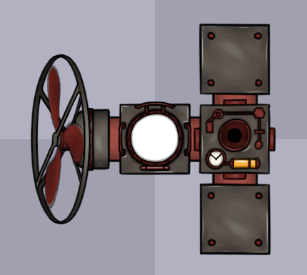

## 文本格式

下文中的文本格式均为 JSON

## 编辑器装置

为了更方便地去处理，这里有一个结构体：`SSerializedEditorDevice`

### JSON

直接存储每个装置的数据，构成一个数组：

```json
[
	编辑器装置 0,
	编辑器装置 1,
	编辑器装置 2,
	编辑器装置 3,
	...
]
```

其中每一个装置都是一个对象，结构如下：

```json
{
	"guidhigh": uint64, // 编辑器装置类型的 GUID，详情见 SEditorDeviceTypeConfig
	"guidlow": uint64,  //
	"x": float, // 坐标是 相对于 驾驶舱 Cabin 来说的
	"y": float, //
	"rot": float, // 旋转也是 相对于 驾驶舱 Cabin 来说的
	"connections": [] // 与该数组中前面的编辑器装置的连接关系
}
```

其中 connections 的每个元素的结构如下：

```json
{
	"to": size_t, // 连接着的【数组】中的编辑器装置的下标（此处的【数组】是指最外层那个存编辑器装置的，不是 connections）
	"ID": int, // 该接口的 ID（不是下标，是 ID，详情见 SEditorDeviceInterfaceDef）
	"toID": int // 与自己相连的 to 的接口的 ID
}
```

### 范例



```json
[
	{
		"connections": [],
		"guidhigh": 11124632734042574262,
		"guidlow": 11640985875138584614,
		"rot": 0.0,
		"x": 0.0,
		"y": 0.0
	},
	{
		"connections": [
			{
				"ID": 0,
				"to": 0,
				"toID": 2
			}
		],
		"guidhigh": 4725241458380522226,
		"guidlow": 13457049288530237759,
		"rot": -3.1415927410125732,
		"x": -112.0,
		"y": 5.595057700702455e-06
	},
	{
		"connections": [],
		"guidhigh": 15774089909195984796,
		"guidlow": 13193609732936951746,
		"rot": -6.2831854820251465,
		"x": 112.0,
		"y": -112.00000762939453
	},
	{
		"connections": [],
		"guidhigh": 15774089909195984796,
		"guidlow": 13193609732936951746,
		"rot": -4.71238899230957,
		"x": 112.0,
		"y": 112.0
	},
	{
		"connections": [
			{
				"ID": 2,
				"to": 0,
				"toID": 0
			},
			{
				"ID": 1,
				"to": 2,
				"toID": 3
			},
			{
				"ID": 3,
				"to": 3,
				"toID": 2
			}
		],
		"guidhigh": 13541370941465250790,
		"guidlow": 11506182755973392982,
		"rot": -0.0,
		"x": 112.0,
		"y": 0.0
	}
]
```

## 装置

